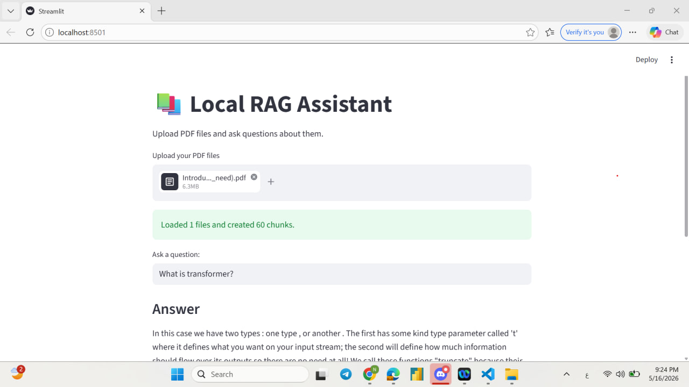

# Local RAG App

Simple local RAG application for uploading PDF files and asking questions about their content.

## Features
- Upload PDF files
- Create embeddings
- Store vectors with FAISS
- Retrieve relevant information
- Generate answers with sources

## Demo

.jpg)
## How to Run

1. Install requirements

pip install -r requirements.txt

2. Run the app

streamlit run app.py
